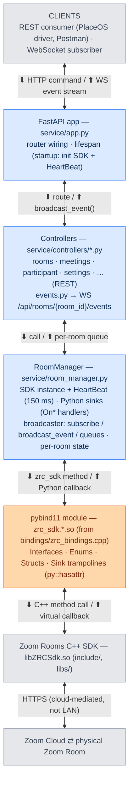
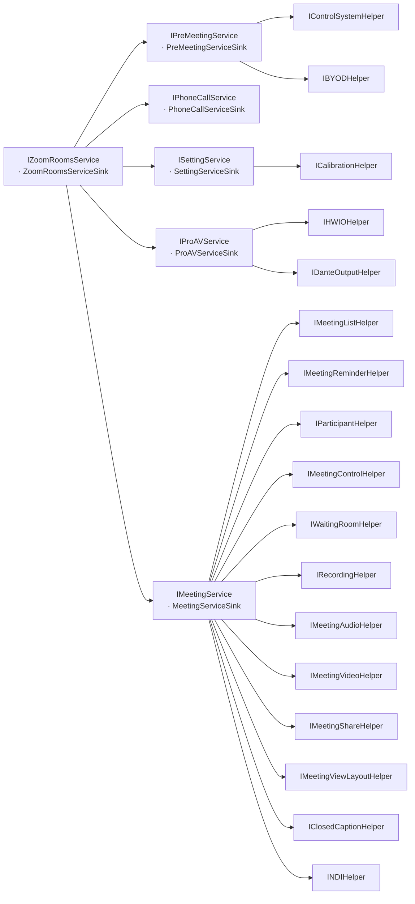
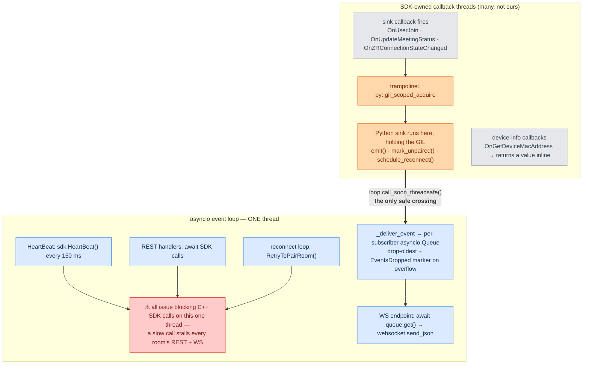
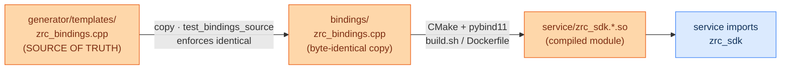
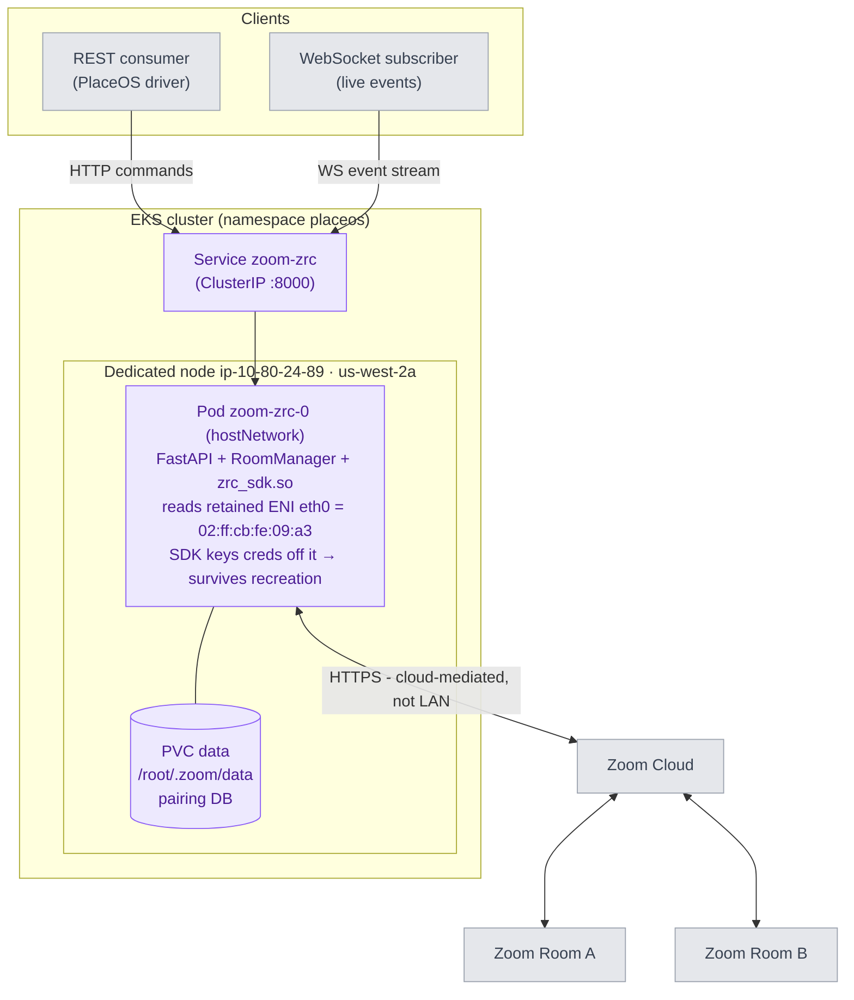
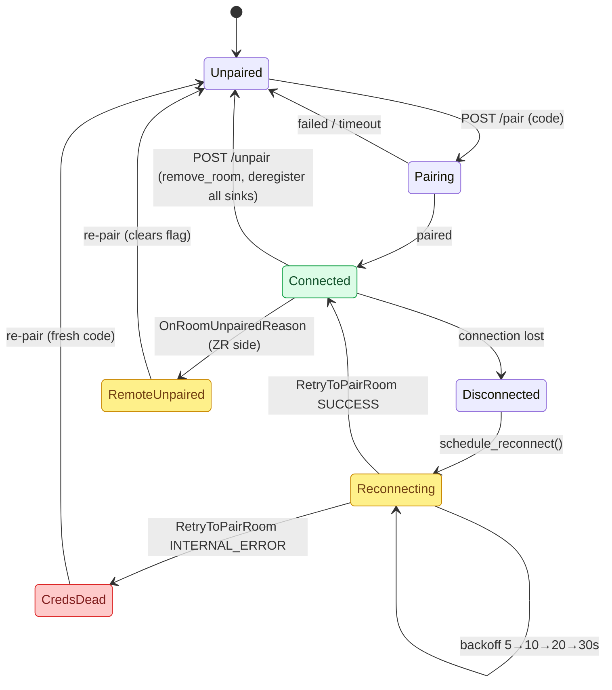
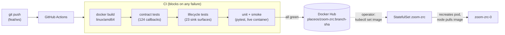

# Architecture — C++ SDK → Python → Clients

This service is a thin wrapper that exposes the native **Zoom Rooms C++ SDK** over
REST (commands) and WebSocket (live events). The key idea is that data flows in
**two directions** through the same layers:

- **Commands** travel *down*: client → REST → Python → pybind11 → C++ SDK → Zoom cloud → room.
- **Events** travel *up*: room → cloud → C++ SDK callback → pybind11 trampoline → Python sink → WebSocket → client.

## Layer stack

The same layers, traversed in opposite directions: each edge label reads
**⬇ command / ⬆ event**. One node per layer keeps the stack a clean vertical
spine — this is the orientation map; the diagrams further down zoom into the
parts that aren't a straight line.



_Blue is our code, amber the C++ seam, grey what we don't own — the boundary
between "our Python" and "the closed SDK + Zoom" is the amber node._

## The C++ ↔ Python seam (pybind11 bridge)

Two mechanisms live in `bindings/zrc_bindings.cpp`:

| Direction | Mechanism | Example |
|---|---|---|
| **Python → C++** | `py::class_<Interface>().def("Method", &Interface::Method)` | `IMeetingService.StartInstantMeeting()` |
| **C++ → Python** | **Sink trampoline** — a C++ class implementing the SDK's `*Sink` interface that forwards each callback to a Python object via `py::hasattr` + `attr()` | `MeetingServiceSinkTrampoline::OnUpdateMeetingStatus` → Python `MeetingServiceSink.OnUpdateMeetingStatus` |

Callbacks can fire on an SDK-owned thread, so trampolines take the GIL
(`py::gil_scoped_acquire`) before calling Python, and `broadcast_event` hops onto
the event loop with `call_soon_threadsafe` before touching subscriber queues (see
the [threading model](#threading-model)).

**Enum encoding:** true SDK enums are emitted by **name** (`"MeetingStatusInMeeting"`),
derived from the pybind `py::enum_<>` registration; raw `int32_t` result/error codes
stay numeric (`0 = success`). The inbound path is symmetric — handlers accept an
enum name or int and resolve it against the same bound enum (`_resolve_enum`), so a
client can echo a captured name straight back without knowing the integer.

### A worked event

What actually crosses the wire when a participant joins — the SDK's typed C++
callback becomes a flat JSON event (this is the payload shape a consumer binds to,
which the box-by-box path can't show):

```jsonc
// SDK fires on an SDK thread:
//   IParticipantHelperSink::OnUserJoin(vector<MeetingParticipant>, ConfSessionType)
// → trampoline (GIL) → ParticipantHelperSink.OnUserJoin → emit() → WS client receives:
{
  "event": "OnUserJoin",
  "session": "ConfSessionTypeGeneral",          // enum → name
  "participants": [                              // struct vector → list of flat dicts
    { "userID": 16778240, "userName": "Alice", "isHost": true, "isMySelf": false }
  ]
}
```

## Key files

| Layer | File |
|---|---|
| C++ SDK | `include/`, `libs/libZRCSdk.so` |
| Bindings (source of truth) | `generator/templates/zrc_bindings.cpp` → copied to `bindings/zrc_bindings.cpp` |
| Compiled module | `service/zrc_sdk.*.so` (built by `build.sh` / Dockerfile) |
| SDK lifecycle + sinks + broadcaster | `service/room_manager.py` |
| REST endpoints | `service/controllers/*.py` |
| WebSocket endpoint | `service/controllers/events.py` |
| App wiring | `service/app.py` |
| K8s deployment (stable-MAC node) | `deploy/k8s/zoom-zrc.yaml` |

## Diagrams

Rendered natively by GitHub and most IDEs (Mermaid). Ordered as a reading path:
the domain map, how it's concurrent, how it's built, where it runs, its runtime
states, and how it ships.

**Colour language** (consistent across diagrams, and legible in light or dark):
🟦 **blue** = our Python · 🟧 **amber** = the C++/pybind seam · ⬜ **grey** =
external (closed SDK, Zoom cloud, rooms) · 🟪 **violet** = infra. In the lifecycle
diagram, 🟩/🟨/🟥 green·amber·red = healthy·transient·broken. Colour only
reinforces the labels — the text alone still carries the meaning.

### SDK service & sink object graph

The domain is a **tree**, not a line: from a paired room you reach every
capability by walking `Get*Service()` → `Get*Helper()`. `register_sinks_for_room`
walks exactly this tree and registers **one Python sink per node (23 total)**;
`remove_room` / the lifecycle test walk the same tree in reverse. This is the map
to consult when adding a sink or chasing "where does event X come from."



_Every leaf also has its own `*Sink` (e.g. `IParticipantHelper` →
`ParticipantHelperSink`); omitted on the helpers to keep the tree legible._

### Threading model

The subtle part of the runtime: **two kinds of thread**, and one narrow bridge
between them. Everything Python-async lives on a **single event-loop thread**;
SDK callbacks arrive on **SDK-owned threads** you don't control. The only safe
crossing is `loop.call_soon_threadsafe`, and Python may only run on an SDK thread
while holding the GIL. Most timing bugs live at this boundary.



_Two aspects share the single loop thread: the **command side** (HeartBeat,
handlers, reconnect all issue SDK calls) and the **delivery side** (queue →
WebSocket). A blocking SDK call on any of them stalls all of it — which is why
`RetryToPairRoom()` on the loop is a known sharp edge._

### Bindings: source of truth → compiled module

The C++ layer is **generated**, so there's a rule that's easy to break: edit the
template, never the copy. A test asserts the two stay byte-identical.



### System context & deployment topology

Where the service runs and who talks to whom. The SDK-visible MAC comes from the
dedicated node's retained ENI (`hostNetwork`), which is what makes pairing
credentials survive pod recreation (see FINDINGS.md §2–4).



### Room connection lifecycle

The `RetryToPairRoom` result discriminates the two failure modes: `SUCCESS` =
transient (auto-reconnect handles it), `INTERNAL_ERROR` = credentials dead
(MAC changed — needs a fresh activation code).



_`CredsDead` = credentials can't decrypt (MAC changed); the `RetryToPairRoom`
result is the discriminator between a transient drop and dead credentials._

### Build & deploy pipeline

Immutable image tags derived from the commit; tests gate the registry push;
deploys are a manual `set image` with the minted tag.


