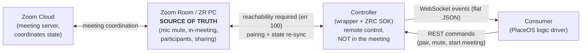
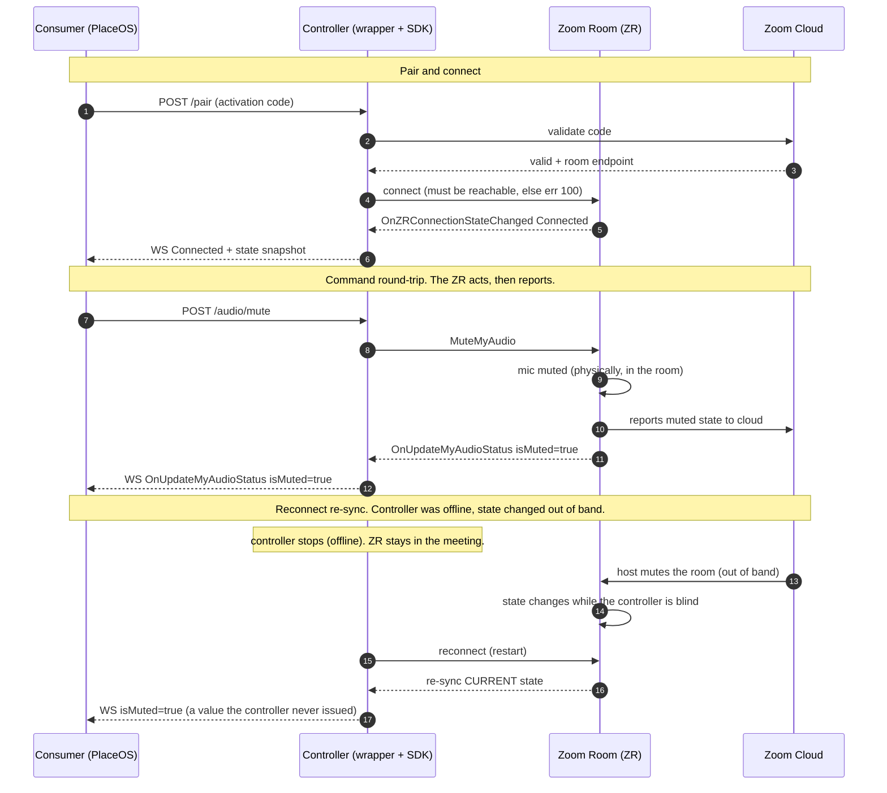
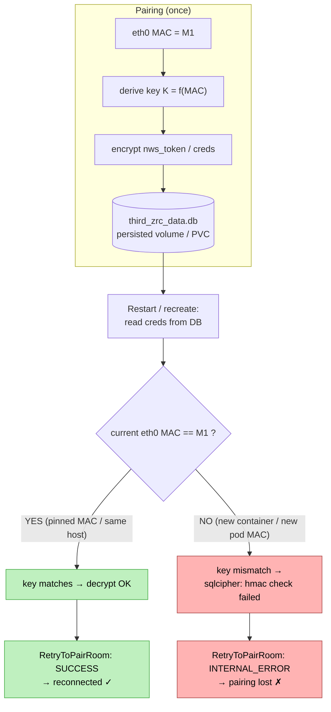
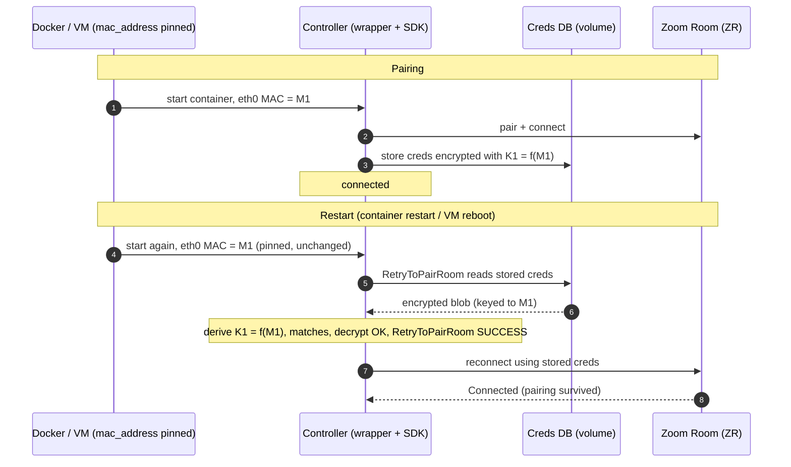
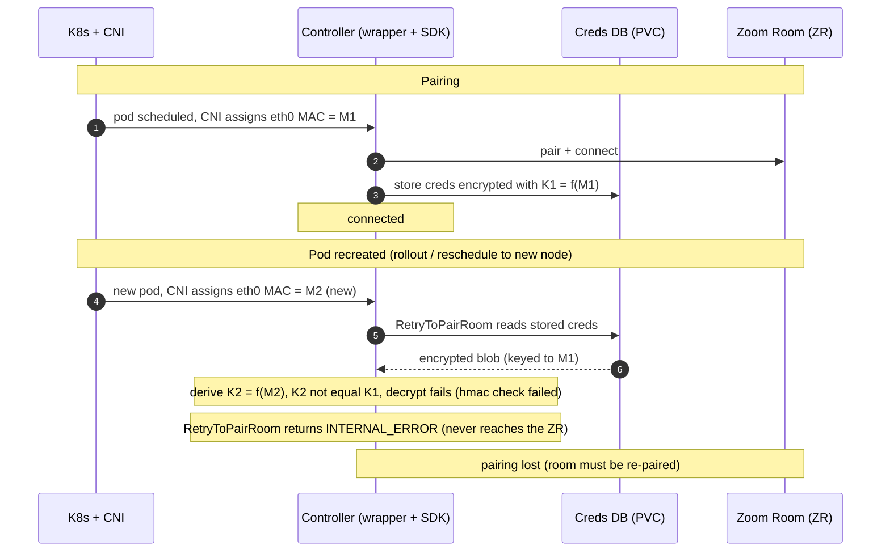
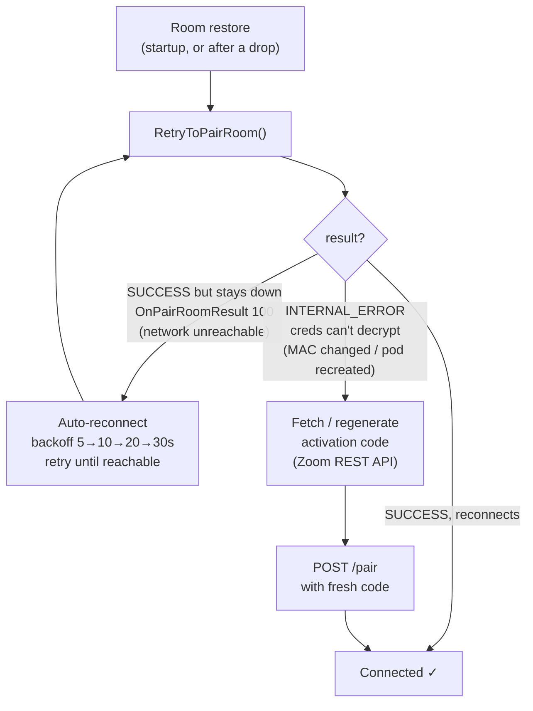

# Zoom ZRC Wrapper — Findings & Investigation Notes

_Last updated: 2026-07-23_

A consolidated reference for the `feat/ws` work and the paired-room persistence
investigation. Written to hand off to the team.

---

## TL;DR

1. **New feature (`feat/ws`):** live WebSocket event streaming, meeting/participant
   sinks, and self-healing auto-reconnect — built, validated end-to-end against real
   rooms. Ready to commit/merge.
2. **Root cause of "pairings don't survive restart":** the ZRC SDK encrypts stored
   room credentials with a key derived from the host's **NIC (`eth0`) MAC address**.
   Anything that changes the MAC (a fresh Docker container, a recreated K8s pod)
   changes the key → the stored credentials can't be decrypted → the room won't
   reconnect and must be re-paired.
3. **Local fix (works):** pin the container MAC in `docker-compose.yml` (`mac_address:`).
4. **Prod/nonprod (EKS): the MAC can't be stabilized in-cluster** — the Compose pin
   doesn't apply to K8s; the in-pod `eth0` MAC pin **breaks the AWS VPC CNI**; and an
   isolation test **proved the SDK keys encryption off the real `eth0` MAC** (no env/SDK
   lever). **So the fix is to auto-recover, not prevent:** Zoom's REST API can regenerate a
   room's activation code, so the service can detect a dead pairing and re-pair itself.
   Three paths in §7 — (1) automated re-pair via the Zoom API (recommended, stays on K8s),
   (2) a Zoom support ticket for a supported stable-identity mode, (3) move to a dedicated
   EC2 VM where the MAC is stable.

---

## Architecture & source of truth

The **Zoom Room (ZR)** is the meeting participant and the **source of truth** for state
(mic mute, in-meeting, participants). The **controller** (this wrapper + the ZRC SDK) is a
*remote control* that connects to the ZR and mirrors its state; it never owns state. On
reconnect it re-syncs whatever the ZR currently is.



**Layer-to-layer flow (ladder / sequence view)** — pair, a command round-trip, and the
reconnect re-sync:



- The controller talks to the **ZR**, not to the cloud, for room/meeting state (the
  `OnZRConnectionStateChanged` callback = its connection *to the Zoom Room*).
- Callbacks are a **live read of the ZR's actual state** — even your own commands round-trip
  (command → ZR acts → ZR reports new state → callback). Proven by an out-of-band test:
  mute the room while the controller is offline, and on reconnect it reports `isMuted:true`
  — a value it never issued.
- The wrapper does **not** cache/replay state to a newly-connected WS consumer, so a
  reconnecting consumer bootstraps from a snapshot (`GET /state` / snapshot-on-subscribe)
  then follows live deltas — deferring to `connection_state` for whether that's live or stale.

## 1. The feature — live WebSocket event streaming (`feat/ws`)

**What it adds**
- `GET /api/rooms/{room_id}/events` — per-room WebSocket; subscribers receive SDK
  callbacks as flat JSON in real time as they fire.
- Schema: enums emitted **name-only** (e.g. `"MeetingStatusInMeeting"`), raw `int32`
  result/error codes stay numeric, full struct passthrough (consumer curates). Idle
  **keepalive** every 30s.
- New sinks: `MeetingServiceSink`, `ParticipantHelperSink`, plus 15 more service/helper
  sinks (recording, audio, video, share, layout, captions, phone, settings, ProAV,
  HWIO, Dante, NDI, control system, BYOD, calibration). Resolves the four sinks left
  "pending" in the prior 1.2.0 notes.
- **Auto-reconnect (self-healing):** on `OnZRConnectionStateChanged → Disconnected`,
  the wrapper runs a per-room backoff loop (5s→10s→20s→cap 30s) calling
  `RetryToPairRoom()` until reconnected; stops on `Connected`; gives up on
  `OnRoomUnpairedReason`.

**Validated end-to-end (local Docker, amd64):**
- Paired two real rooms simultaneously (`lab` remote-over-VPN, `lab2` local bridged VM).
- Started meetings; observed `OnUpdateMeetingStatus`, `OnUserJoin`,
  `OnInitMeetingParticipants`, sharing/recording/audio/video events streaming per room.
- Confirmed **per-room isolation** (distinct participant JIDs, hardware, NDI configs).
- Confirmed **auto-reconnect self-heal**: took `lab2` offline → wrapper retried on
  backoff → reconnected on its own when the room returned, then stopped retrying.
- Confirmed a room going offline is transmitted over the WS
  (`OnZRConnectionStateChanged → ConnectionStateDisconnected`).

---

## 2. Root cause — paired-room persistence



> **Keeps MAC == M1 (works):** docker-compose `mac_address` pin · same long-lived host (EC2).
> **Changes the MAC (breaks):** a new `docker run` · K8s pod recreation (CNI assigns a new MAC).
> **No effect on the key (proven):** `ZRC_DEVICE_MAC` env / `OnGetDeviceMacAddress`.
> **In-pod `ip link set` MAC pin on EKS:** breaks the AWS VPC CNI (pod loses its network path).
>
> _Same diagram rendered via Graphviz: `docs/mac-issue.graphviz.png` (source: `docs/mac-issue.dot`)._

**Layer-to-layer view (ladders)** — the same pairing, two environments.

_Docker / VM with a pinned MAC — the MAC stays `M1`, so the pairing survives a restart:_



_Kubernetes — pod recreation gives a **new** MAC (`M2`), so the creds can't decrypt and the pairing is lost:_



### The mechanism
- The SDK persists credentials in `~/.zoom/data/third_zrc_data.db` (per-field encrypted;
  `nws_token`, `nws_sec_fgp`, `nws_sec_fgp_key`) plus SQLCipher DBs
  (`local_dns_cache.db`, `telemetrydata.db`) and `ZRCSDK.conf`.
- The encryption **key is derived from the host's `eth0` MAC address.**
- When the MAC changes, the key changes, and the stored credentials become undecryptable.

### Failure signature (how to recognize / detect it)
When the MAC isn't stable and the stored credentials can't be decrypted, the failure
surfaces at four layers:

**1. SDK core (SQLCipher) — container logs:**
```
ERROR CORE sqlcipher_page_cipher: hmac check failed for pgno=1
ERROR CORE sqlite3Codec: error decrypting page 1 data: 1
ERROR CORE sqlcipher_codec_ctx_set_error 1
```

**2. Room-restore path — `room_manager.py` logs:**
```
QueryAllZoomRoomsServices result: ZRCSDKERR_SUCCESS
Found 0 room(s) via QueryAllZoomRoomsServices          # SDK can't see it (can't decrypt)
Found 1 previously paired room(s) in database          # fallback sqlite read still finds the row
  - Restoring room: <id>
  RetryToPairRoom result: ZRCSDKError.ZRCSDKERR_INTERNAL_ERROR   # <-- THE signal
```

**3. API / state:**
```
GET /api/rooms -> {"room_id":"<id>","paired":true,"connection_state":"ConnectionState.ConnectionStateNone"}
```
Paired, but never reaches `Connected`.

**4. On disk:** the SDK writes `.decfail` siblings for DBs it can't decrypt
(`local_dns_cache.db.decfail`, `telemetrydata.db.decfail`).

### Detecting it programmatically (for auto-recovery)
The clean discriminator between the two failure modes is the `RetryToPairRoom` result on
a room that exists in the DB:

| Scenario | `RetryToPairRoom` | Recovery |
|---|---|---|
| Transient network drop (creds still valid) | `SUCCESS`, reconnects shortly | auto-reconnect (already built) |
| Dead creds (MAC changed / pod recreated) | **`INTERNAL_ERROR`** | fetch fresh activation code → re-pair |

Today this result lives **only in the logs** — `/api/rooms` exposes `paired` +
`connection_state` but not the restore result. To automate recovery cleanly, surface it
as structured state (e.g. a `needs_repair` / `restore_error` field on the room + a WS
event) so the logic layer can trigger off it without log-scraping.

### What is / isn't the key
- **IS the key:** the actual `eth0` NIC MAC.
- **Is NOT the key:** the `ZRC_DEVICE_SERIAL` / `ZRC_DEVICE_MAC` env vars — those feed the
  `OnGetDeviceMacAddress` callback (the identity *reported to Zoom*), not the encryption
  key. **Proven by controlled isolation test (2026-07-24):** paired a room with NIC
  MAC = M1 and `ZRC_DEVICE_MAC` = `AA:AA:AA:AA:AA:AA`, then restarted with the **same
  volume + same `ZRC_DEVICE_MAC`** but NIC MAC = M2. Result: `hmac check failed` →
  `RetryToPairRoom: INTERNAL_ERROR`. Only the NIC MAC changed, and it broke → the key
  follows the **real `eth0` NIC MAC**, not the value we return from the callback.
  **Consequence: there is no SDK-side / env-var fix — the SDK gives us no lever over its
  encryption key.**
- Copying the `.zoom` folder between environments does **not** help — the data travels
  but the key (MAC-derived) does not.

### Restart behavior (important nuance)
- **Container restart within the same pod/container-host** (crash, liveness restart) →
  network namespace is preserved → **same MAC → pairing survives.**
- **Fresh container (`docker run`) or recreated K8s pod** (image update, reschedule) →
  new MAC → **pairing lost, must re-pair.**

---

## 3. Local fix (works) — pin the MAC in docker-compose

`docker-compose.yml`:
```yaml
services:
  zrc-microservice:
    mac_address: c0:ff:ee:11:00:99   # pick once, NEVER change it
    platform: linux/amd64            # SDK is x86_64-only; emulates on Apple Silicon
```
Verified: pair a room, `docker restart`, and it reconnects **without** re-pairing
(`RetryToPairRoom: SUCCESS`, no `hmac` error). Works for multiple rooms at once.

> ⚠️ Never change a pinned MAC once a room is paired against it — it orphans the
> encrypted credentials (same failure as above). Use a valid unicast,
> locally-administered MAC (first octet even, e.g. `DE`/`CA`/`FE`/`C0`).

---

## 4. Kubernetes / EKS — status: NOT fixed

### Why the Compose fix doesn't carry over
Docker Compose and Kubernetes are separate orchestrators that share only the **image**.
K8s never reads `docker-compose.yml`; it builds pods from its own StatefulSet manifest,
and **the pod spec has no `mac_address` field.** So the pin simply isn't expressible the
same way.

### Prod/nonprod deployment facts (namespace `placeos`, EKS)
- StatefulSet **`zoom-zrc`**, single replica, image `placeos/zoom-zrc:main-<sha>`.
- Managed by **plain `kubectl apply`** (only `last-applied-configuration` annotation — no
  Helm/Argo/Flux). Direct patch/apply sticks; the source manifest lives in a deploy repo
  / runbook (find and update it so a future `apply` doesn't drop changes).
- PVC `data` (retention `Retain`) mounted at `/root/.zoom/data`; env via ConfigMap
  `zoom-zrc`; Karpenter node pool `placeos`; **AWS VPC CNI**.
- CI publishes `placeos/zoom-zrc:<branch>-<shortsha>`. Update the running version with:
  `kubectl -n placeos set image statefulset/zoom-zrc zoom-zrc=placeos/zoom-zrc:<tag>`.

### What we tried and why it failed
Added an **initContainer** that pins `eth0`'s MAC before the app starts (K8s has no MAC
field, so you set it from inside the pod):
```yaml
spec:
  template:
    spec:
      initContainers:
      - name: pin-mac
        image: busybox:1.36
        securityContext:
          capabilities:
            add: ["NET_ADMIN"]
        command: ["sh","-c","ip link set dev eth0 address c0:ff:ee:11:00:99 && ip link show eth0"]
```
Results:
- ✅ The **MAC pin itself worked** — `NET_ADMIN` was allowed by admission, busybox `ip`
  set the MAC (`eth0 … link/ether c0:ff:ee:11:00:99`), init ran before the app.
- ✅ The **app came up and egress worked** — `InitWebDomain: SUCCESS` (reached Zoom cloud).
- ❌ The pod **never went Ready (`0/1`), and got restarted** — the health probe
  (kubelet on the node → pod:8000) couldn't reach the pod.
- **Diagnosis:** changing `eth0`'s MAC breaks the **node→pod (ingress) path** on the AWS
  VPC CNI — the CNI ties delivery to the pod to the MAC it originally assigned. Egress
  works, ingress doesn't → probes fail → restart loop.
- **Reverted cleanly** by removing the initContainer + deleting the pod; back to `1/1`.

**Conclusion: in-pod MAC pinning is a dead end on the AWS VPC CNI.**

---

## 5. Secondary fixes made on `feat/ws`

- **GIL guards on `SimpleSinkImpl`** — its 11 device-info callbacks now
  `py::gil_scoped_acquire` before touching Python (they fire on SDK threads), matching
  every other trampoline. Mirrored into `generator/templates/zrc_bindings.cpp`.
- **Clean shutdown (`os._exit(0)` in `app.py`)** — the SDK's static `RegisterSink`
  registries (and `g_sdk_sink_impl`) hold `py::object`s destroyed during C++ static
  teardown **after `Py_Finalize`**, which aborts with
  `PyThreadState … thread state is NULL` (`signal 6`) on shutdown/restart. Hard-exiting
  after graceful shutdown skips finalization and eliminates the crash (verified 0 crashes
  across repeated restarts).
- **`platform: linux/amd64`** in `docker-compose.yml` — the SDK ships x86_64-only, so on
  Apple Silicon this forces emulation (matches prod) instead of a native arm64 build that
  fails to link.

---

## 6. Testing (see `TESTING.md`)

| Tier | File | Verifies | Real room? | In CI? |
|------|------|----------|------------|--------|
| 1 — Contract | `service/test_sink_contracts.py` | all 124 forwarded callbacks serialize correctly | no | ✅ |
| 2a — Safe API | `service/tests/test_api.py` (unmarked) | service up, routes, schemas, error handling | no | ✅ |
| 2b — Live e2e | `service/tests/test_api.py` (`@pytest.mark.live`) | real pair→meeting→WS→mute→exit | **yes** | ❌ (manual) |

- Tier 1 caught a real regression from the auto-reconnect work on its first run.
- Live e2e passed against `lab2` (start meeting → `InMeeting` + participant + mute events
  on the WS → exit).
- CI (`.github/workflows/dockerhub-build-push.yml`) now does **build → test → push**:
  runs Tier 1 + Tier 2a and blocks the push on failure; uploads a JUnit artifact. Tier 2b
  is a manual pre-release step (needs hardware).

---

## 7. Paths forward — three options

Persistence on EKS **cannot** be solved by pinning the MAC (the in-pod pin breaks the AWS
VPC CNI — §4) or via the SDK/env (the key follows the real `eth0` MAC — §2, proven; the
SDK exposes no key/identity/encryption config; Multus only adds a secondary interface, not
`eth0`). So the three real paths are below. They are **complementary, not mutually
exclusive.**



_The `RetryToPairRoom` result is the discriminator: `SUCCESS`→transient (auto-reconnect, already built); `INTERNAL_ERROR`→dead creds (Option 1 below). Together they make both failure modes self-healing._

### Option 1 — Automated re-pair via Zoom REST APIs (recommended; stays on K8s)
Instead of *preventing* the break, **auto-recover** from it. Zoom's REST API exposes room
activation codes:
- Read existing: `GET /v2/rooms` and `GET /v2/rooms/{roomId}` return an `activation_code`.
- Regenerate fresh: `GET /v2/rooms/{roomId}?regenerate_activation_code=true`.
- Auth: a Server-to-Server OAuth app with Zoom Rooms scopes (e.g. `rooms:read:admin`).

Self-heal loop: detect a room stuck at `RetryToPairRoom → INTERNAL_ERROR` (§2
discriminator) → fetch/regenerate that room's code via the Zoom API → call the wrapper's
`POST /api/rooms/{id}/pair`. Together with the existing auto-reconnect, **both** failure
modes (transient drop, dead creds) self-heal with no human — and it keeps the service on
K8s.
- Build items: surface the `needs_repair` / `restore_error` signal (§2); a
  `room_id → Zoom roomId` mapping; hold the Zoom S2S creds in the logic layer; only
  regenerate when a room is actually down; verify whether regeneration fires admin emails.
- Interim until built: re-pair manually after each deploy.

### Option 2 — File a Zoom support ticket (long-term; run in parallel)
Ask Zoom for a supported way to run the ZRC SDK in ephemeral/containerized environments
with a stable identity. Lead with the smallest change: **make the SDK derive its storage
key from the `OnGetDeviceMacAddress` / `OnGetDeviceSerialNumber` values the app already
provides** instead of reading the real NIC — the callbacks already exist; only the key
derivation needs to honor them. Alternatives: an explicit device-ID or storage-key config.
Frame it as enabling large-scale centralized Zoom Rooms management (drives license
adoption), not bypassing security; include the §2 isolation-test evidence. Slow/uncertain,
so pursue alongside Option 1.

### Option 3 — Run on a dedicated EC2 instance (sidesteps the problem)
Move the service off K8s onto a persistent EC2 VM. A stopped/started (not terminated) EC2
instance keeps its ENI MAC, so `eth0` is stable → pairing persists exactly like local
Docker (with the Compose `mac_address` pin, or even without). Trade-off: you give up K8s
orchestration (self-healing, centralized rollout) for a "pet" VM to manage. Viable if this
service doesn't need the cluster. Simplest to reason about — no code, no Zoom dependency.

**Recommendation:** build **Option 1** (keeps K8s, fully automated, no external
dependency) and file **Option 2** in parallel for a real long-term fix. Fall back to
**Option 3** if you'd rather not build the automation and are comfortable running this
service on its own VM.

**Note:** nonprod's `lab` room likely needs a one-time re-pair now (the MAC bounced during
testing) — it was already in that state before we started.

---

## 8. Quick reference

**Inspect a running pod's data (prod/nonprod):**
```bash
kubectl -n placeos exec zoom-zrc-0 -c zoom-zrc -- ls -la /root/.zoom/data
kubectl -n placeos exec zoom-zrc-0 -c zoom-zrc -- \
  python -c "import sqlite3;c=sqlite3.connect('/root/.zoom/data/third_zrc_data.db');print(c.execute('SELECT pk_id FROM ThirdRoomList').fetchall())"
```

**Bump the deployed image:**
```bash
kubectl -n placeos set image statefulset/zoom-zrc zoom-zrc=placeos/zoom-zrc:<branch>-<sha>
kubectl -n placeos rollout status statefulset zoom-zrc
```

**Key endpoints:**
- Pair: `POST /api/rooms/{room_id}/pair` body `{"activation_code":"..."}`
- Events (WS): `GET /api/rooms/{room_id}/events`
- Health: `GET /health`

**Key files:**
- `bindings/zrc_bindings.cpp` (+ `generator/templates/zrc_bindings.cpp`, source of truth)
- `service/room_manager.py` (sinks, broadcast, auto-reconnect)
- `service/controllers/events.py` (WS endpoint)
- `docker-compose.yml` (`mac_address`, `platform`)
- `TESTING.md`, `CHANGELOG.md`
